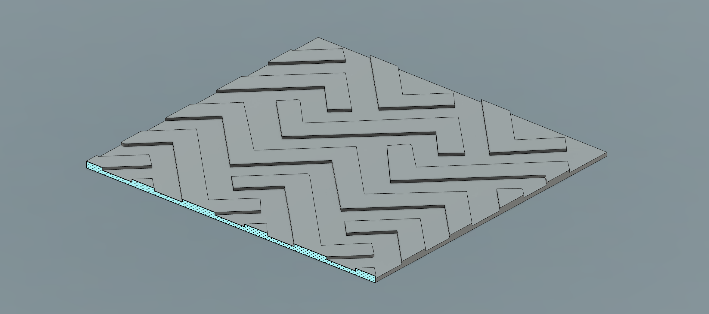

# Selective Ironing

Iron graphics on the top layer (3D printing post-processing script).

## Installation

1. Download the `selective-iron-postprocess.py` script
2. Note its full file path
3. In PrusaSlicer, go to **Print Settings** > **Output options** > **Post-processing scripts**
4. Paste the absolute path to the script

## Setup Instructions

### In PrusaSlicer:
1. Enable **Ironing** for the **Topmost surface only**
2. Set ironing **Flow rate** to **0%**

### In Your Model:
Design your part with a 1-layer-tall extrusion on the topmost surface representing the graphics you want ironed.

### Slicing:
Slice and print. Note that post-processing effects won't show in the slicer preview.

## How It Works

The script:
- Extracts all ironing move blocks from the top layer
- Automatically detects layer height and Z position
- Converts flat travel moves into proper retract/lift/travel/lower sequences
- Positions ironing moves at the optimal height for surface polishing
- Replaces the entire top layer with only the ironing passes

## Requirements

- Python 3.6 or later
- PrusaSlicer
